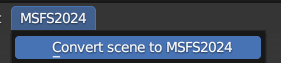
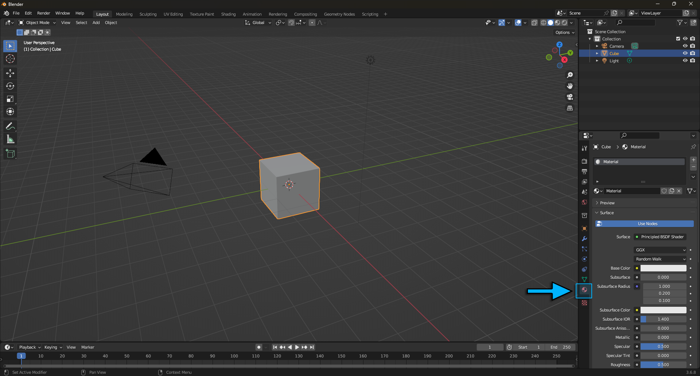
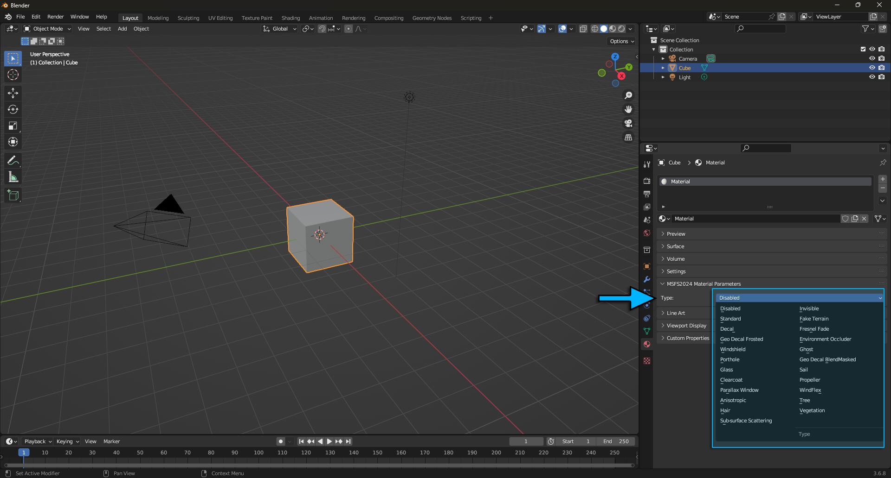
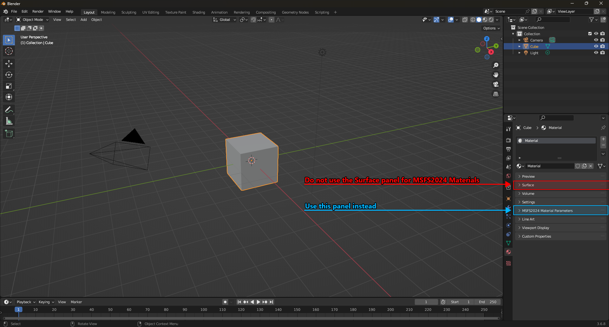
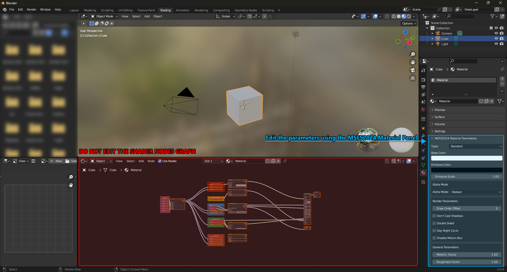
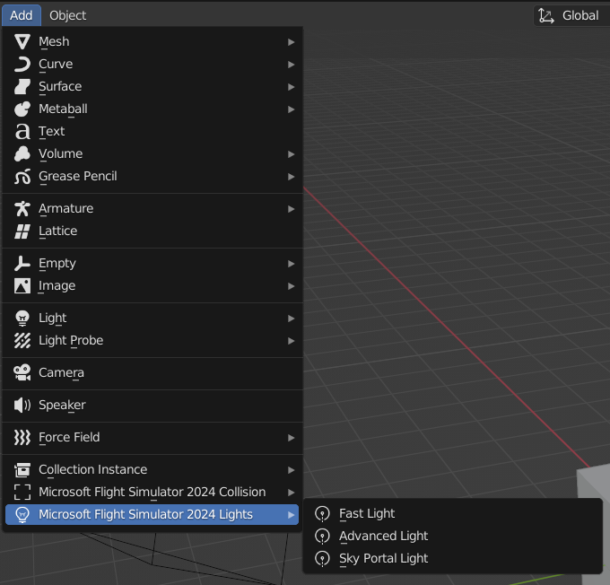
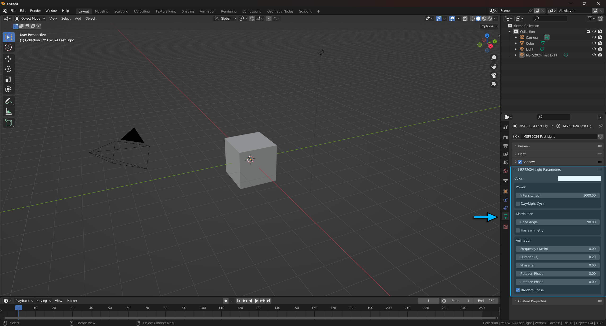
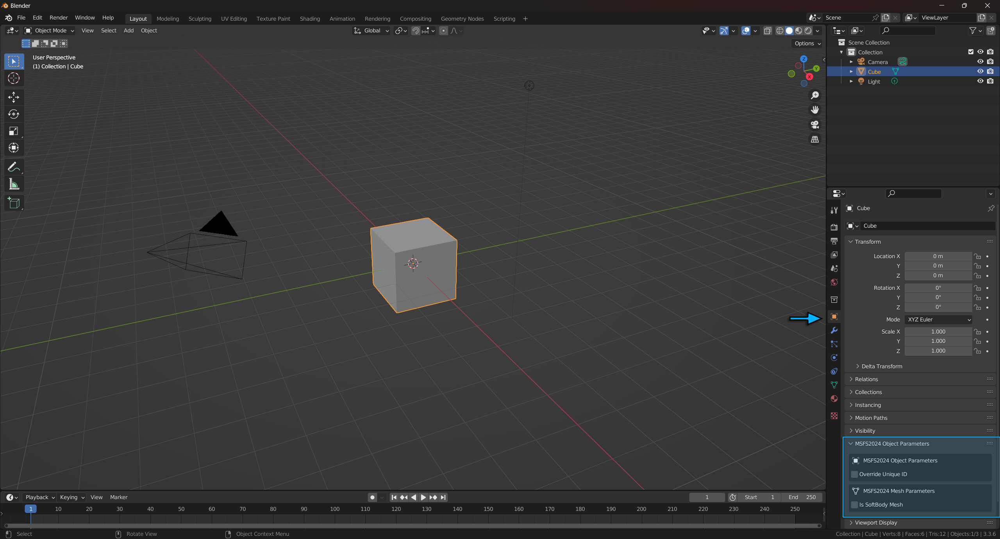
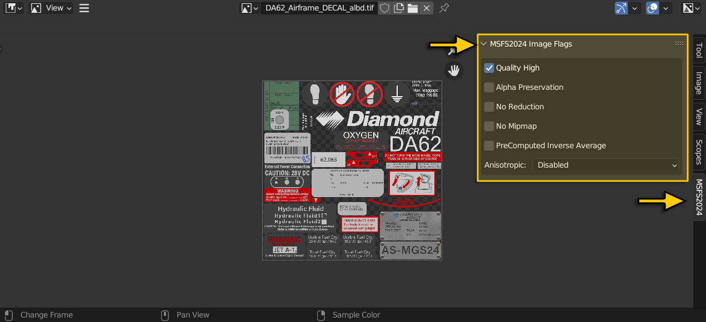

# **Documentation for Microsoft Flight Simulator 2024 glTF 2.0 Importer and Exporter for Blender**

This page outlines the main properties of the Blender add-on for Microsoft Flight Simulator 2024:
1. [MSFS2024 Menu](#msfs2024-menu)
2. [Materials](#material-properties)  
3. [Lights](#light-properties)
4. [Objects](#object-properties)
5. [Images](#image-properties)
6. [Multi-Exporter 2024 glTF 2.0](./MULTIEXPORTER.md)

<br>

## **MSFS2024 Menu:**
In this menu you can find the option :
- **Convert scene to MSFS2024**: This option allows you to convert all your materials to the new MSFS2024 format and all your lights to MSFS2024 street lights. (**Note:** You will need to enable the MSFS2020 plugin for this functionality to work.) <br>


<br>

## **Material Properties:**
- When you select an object in Blender, you can access the material properties panel from the Object Ribbon on the right, under the Material Properties button. 



- When you want to export a model specifically for Microsoft Flight Simulator 2024, you need to ensure that it is set to a dedicated Microsoft Flight Simulator 2024 Material.

- Expanding the **MSFS2024 Material Properties** section will allow you to choose a type from the available material types, and then configure the available options based on it.




- When you set a Microsoft Flight Simulator 2024 Material, you have to edit the material properties from the MSFS2024 Material Parameters section only (**Note:** if you edit the shader nodes it will break the export)





:warning: DO NOT EDIT THE SHADER NODE TREE

- If you want to learn more about the different materials listed and how to use them, you can refer to the SDK documentation on materials here: [MSFS2024 Materials](https://docs.flightsimulator.com/msfs2024/html/3_Models_And_Textures/Textures/Materials/FlightSim_Materials.htm)

<br>

## **Light Properties**

You have a list of MSFS2024 lights that you can add here:



Once you have added one of these lights you can find a new panel called **MSFS2024 Light Properties** in the lights properties view. You can edit these parameters using the specified panel only.



If you want to lean more on what are these parameters, you can refer to the SDK Documentation on lights here: https://docs.flightsimulator.com/html/Asset_Creation/3DS_Max_Plugin/Lights.htm

<br>

## **Object Properties:**
When you select an object, you can override its Unique ID that will be interprated by the sim using this checkbox here:



<br>

## **Image Properties:**
In Microsoft Flight Simulator 2024, for optimisation and flexibility within the simulation reasons, you now have to provide a texture XML file for each texture of the model. Given that a single model can have numerous textures (and therefore require an equal number of XML files), these xml files are exported along  with the gltf by ticking **Generate TextureLib** in the export settings.

You can also set up some flags for your textures in a the **MSFS2024 Images Flags** panel using the **Image Editor** in Blender here:



The generated xml will look like this:
```
    <BitmapConfiguration>
        <BitmapSlot>
            <!-- TEXTURE SLOT HERE -->
        </BitmapSlot>
        <UserFlags Type="_DEFAULT">
            <!-- FLAGS HERE -->
        </UserFlags>
        <ForceNoAlpha>
            <!-- ALPHA TOGGLE -->
        </ForceNoAlpha>
    </BitmapConfiguration>
```

To learn more about texture XML and flags see : [Texture XML Properties](https://docs.flightsimulator.com/msfs2024/html/5_Content_Configuration/Textures/Texture_XML_Properties.htm) 
