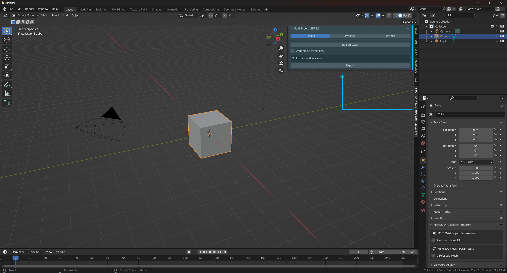
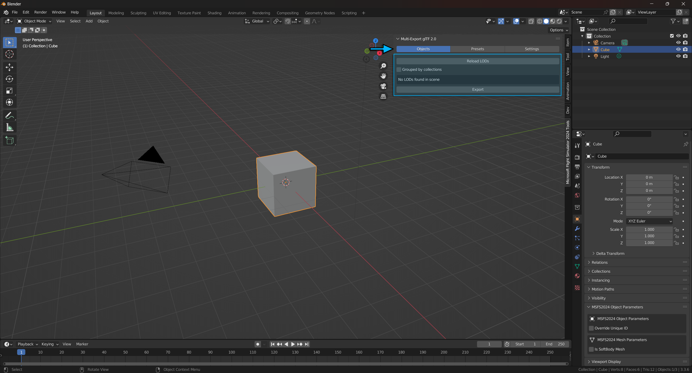
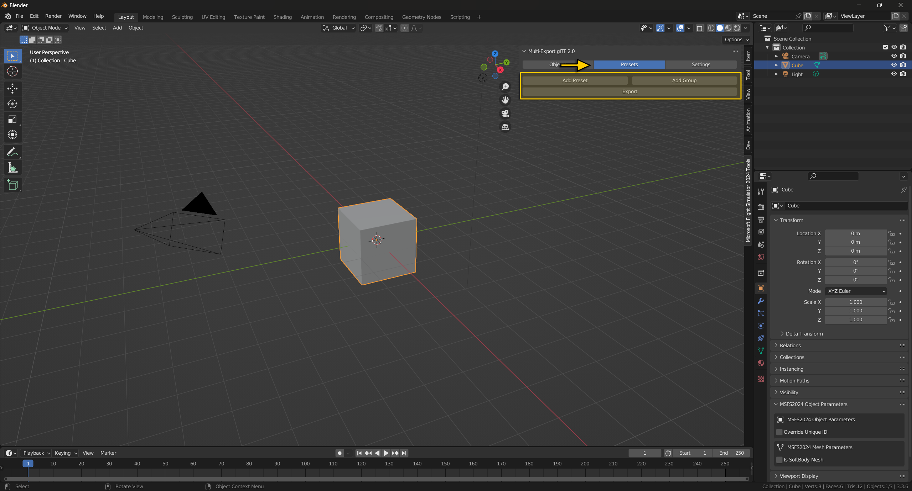
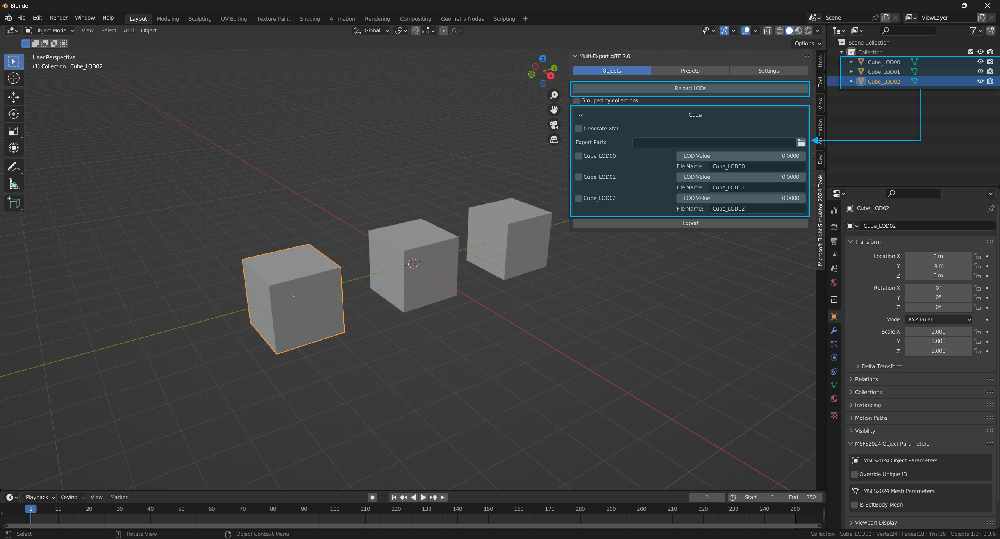
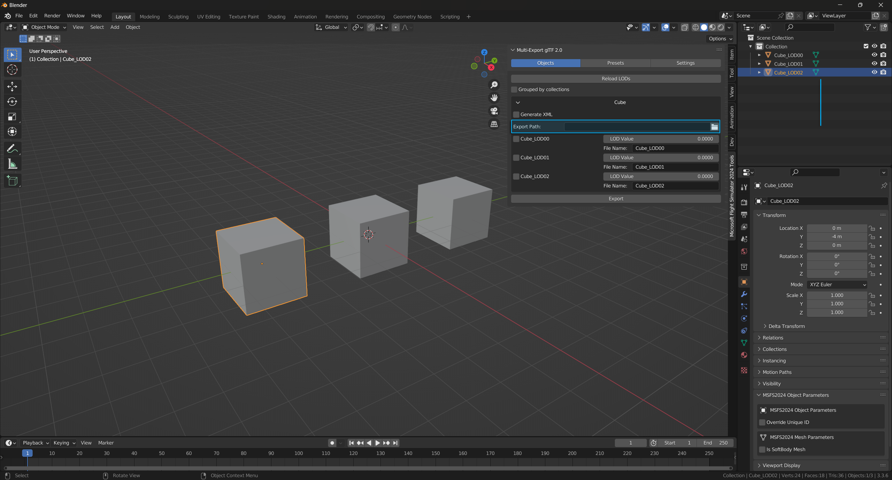
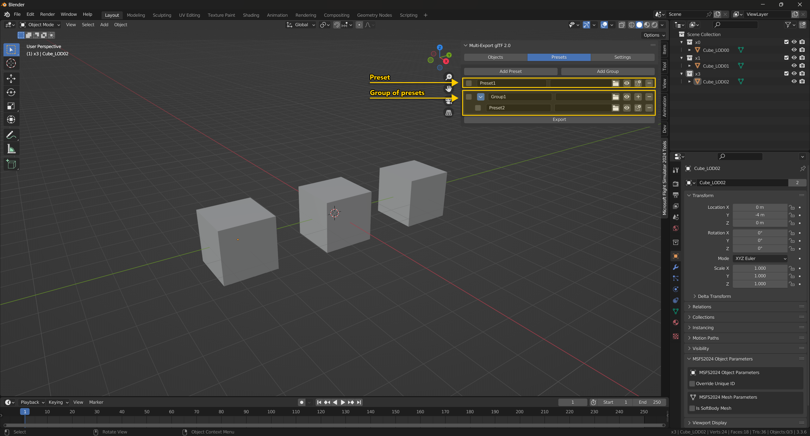
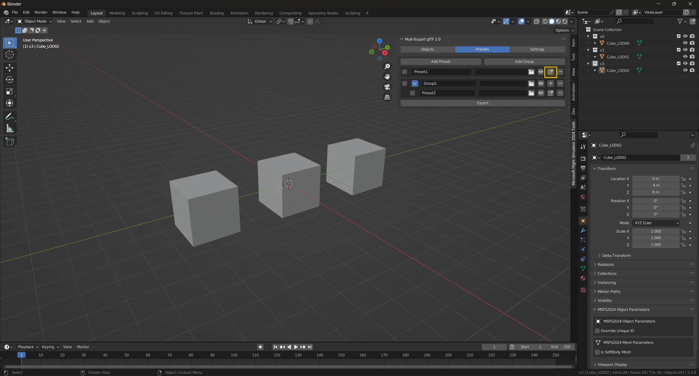
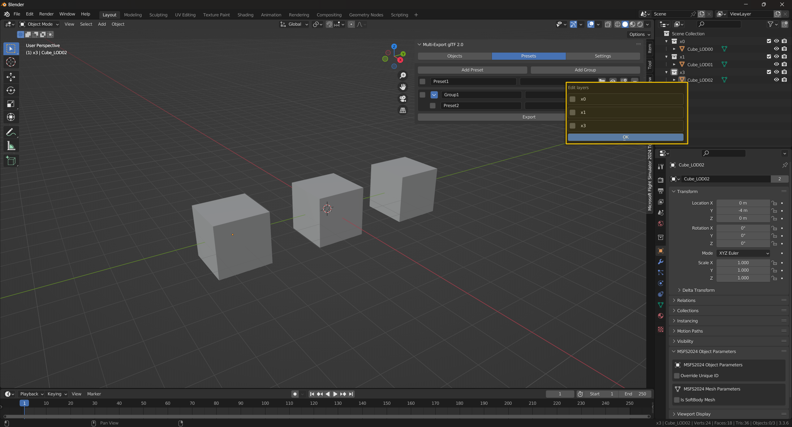
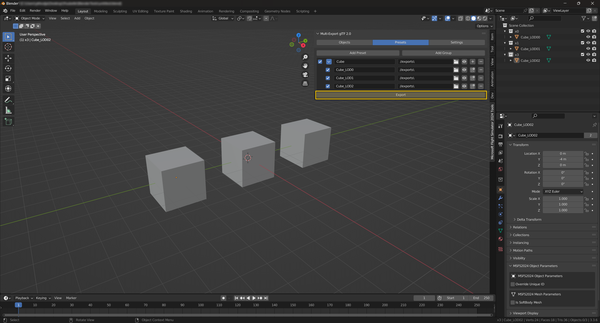
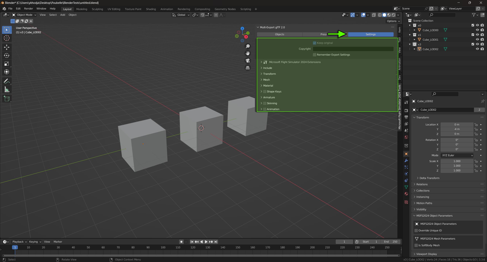

## Multi-Exporter glTF 2.0
- To export your model you need to use the multi-exporter view :



- There are two ways to export your model, you can use the Objects View or the Presets View :





### Objects View :

This view relies on the names of your root nodes in your scene. If your object's name starts with x0_ or ends with \_LOD0 it will be considered a LOD0 ( x1_ and _LOD1 will be LOD1, and so on). The rest of its name defines its category so that all the objects from the same family (ie: different LODs of the same asset) will be sorted together.

- If you click on "Reload LODs" button, it will group your objects with LOD(s) as shown down bellow:



- You need to set an export path that defines the folder where you want to export your LOD(s):



- If you tick "Generate XML" checkbox, it will create the XML file for the families of LOD selected. For example selecting Cube, Cube_LOD0 or all of Cube's LODs will produce the same result and generate one file "Cube.XML" for the Cube family. You can also work with multiple families at once.

#### Example:
```
    <?xml version="1.0" encoding="utf-8"?>
    <ModelInfo guid="{1b7127b5-7223-4980-8cc0-3b5417cb2412}" version="1.1">
        <LODS>
            <LOD minSize="100" ModelFile="Cube_LOD0.gltf"/>
            <LOD minSize="50" ModelFile="Cube_LOD1.gltf"/>
            <LOD minSize="25" ModelFile="Cube_LOD2.gltf"/>
        </LODS>
    </ModelInfo>
```

- If you tick `Enable Auto LOD` this will enable export of only LOD0 of your model, the other LODs will be generated using simplygon (only if you have a licence) when you will build your package in Microsoft Flight Simulator 2024. The AutoLOD system generates 7 LODs and you can switch between them using this debug tool. The minSize for each of the LODs is as follows:
<ol>
    <li>LOD1: 70%</li>
    <li>LOD2: 50%</li>
    <li>LOD3: 35%</li>
    <li>LOD4: 20%</li>
    <li>LOD5: 10%</li>
    <li>LOD6: 5%</li>
    <li>LOD7: <=1%</li>
</ol>

- The resulted model.xml will look like this:
```
    <?xml version="1.0" encoding="utf-8"?>
    <ModelInfo guid="{1b7127b5-7223-4980-8cc0-3b5417cb2412}" version="1.1">
        <LODS autoGenerate="true"/>
    </ModelInfo>
```

### Presets View :
The Presets View allows you to create Export Presets that will make it easier to export a large numbers of objects, animations and more. This exporter relies on Collections to be selected and added to a Preset, so you will need your scene to be split into relevant collections.

- If you click on "Add Preset" Button, a new element will be added to the view (see figure down bellow). You can set it's name, export folder, its collections and enable it for export.

- If you click on "Add Group" Button, a new element will be added. The group allow you to group presets, tick them all at one to be exported and give them the same export path.



- You will need to define which collections are applied to this Preset by clicking on "Collections" Button, don't forget to click on "Ok" when you have checked your collections :





- The eye button will show you in the 3D viewport only the objects contained in the collections you have set up to the presets or the group.

- When all your presets are set up you can click on "Export" Button to export your models:



## Settings View :
Here you can find the various export settings (geometry, animations, materials...etc) from the glTF export in Blender. You can disable the Microsoft Flight Simulator 2024 Extensions if you want to export your models as pure glTF(s) following the Khronos Schemas. These settings are different from one version of Blender to another.

