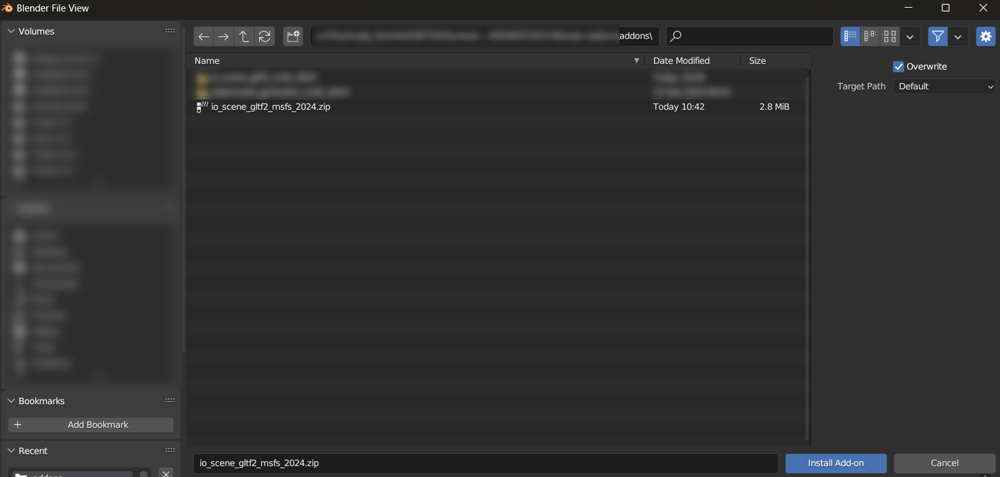
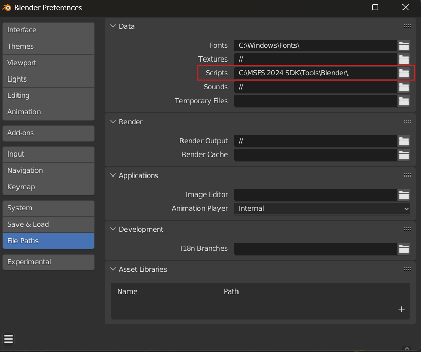
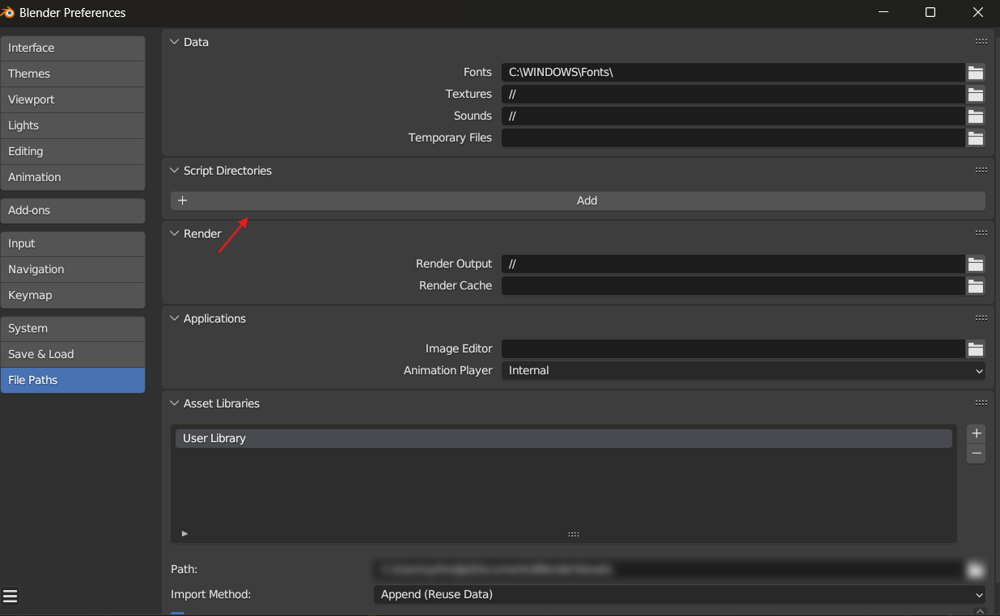
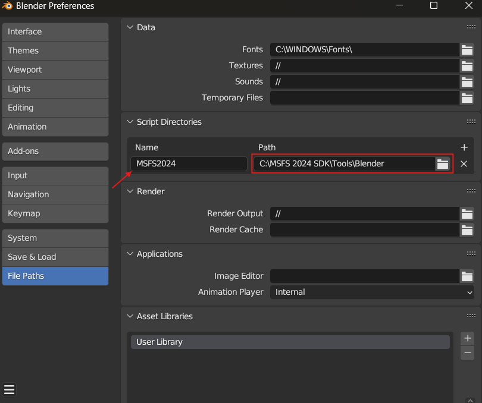

 

# Microsoft Flight Simulator 2024 glTF 2.0 Importer and Exporter for Blender

This folder contains the current version of the official Microsoft Flight Simulator 2024 Blender Import/Export plugin. The flight sim community has already developed and forked the original project many times, and Asobo's intention is to fully support Blender with the help and contributions of all the developers that have already implemented features in the different unofficial Blender plugins.

>Asobo would especially like to thank the following people:  
>Vitus of [Wing42](https://wing42.com/), [tml1024](https://github.com/tml1024), [ronh991](https://github.com/ronh991), [pepperoni505](https://github.com/pepperoni505)

:warning: This plugin cannot import glTF files that have been built into a Microsoft Flight Simulator 2024 package through the Simulator's Package Builder.
 
:warning: The version 0.3.x is only compatible with Blender 3.3.x LTS and 3.6.x LTS. Other versions are not supported.
 
:warning: We recommend not enabling both add-ons (MSFS2020 and MSFS2024) at the same time. It's fine to have them both installed, but only enable the one required for your export/import process, based on the specific game you're working with. Make sure to switch between add-ons depending on which game it's intended for.
 
:warning: This plugin is NOT compatible with the legacy exporter developed for FSX and P3D and MSFS.  Remove these plugin (Prefered) or disabled these plugins.

*******

# Summary
- [How to Install the Add-on](#how-to-install-the-add-on)
  - [How to Install the ASOBO Blender MSFS2024 Importer/Exporter using Blender and the addon zip](#how-to-install-the-asobo-blender-msfs2024-importer/exporter-using-blender-and-the-addon-zip)
  - [How to Install the ASOBO Blender MSFS2024 Importer/Exporter using addons path](#how-to-install-the-asobo-blender-msfs2024-importer/exporter-using-addons-path)
  - [How to Install the ASOBO Blender MSFS2024 Importer/Exporter by Copy/Paste to AppData](#how-to-install-the-asobo-blender-msfs2024-exporter-by-copypaste-to-appdata)
- [How to remove the Add-on](#how-to-remove-the-add-on)
- [Documentation](#documentation)
- [Notes on Shader Nodes Tree](#notes-on-shader-nodes-tree)
- [Add-on limitations](#add-on-limitations)

*******

# How to Install the Add-on

There are three ways to install the MSFS2024 Blender exporter. Either using the Edit Preferences Menu and Install tab, copy/paste the addon files to your %APPDATA% folder or give Blender the path to addon folder. Installation steps are explained down bellow :

## How to Install the ASOBO Blender MSFS2024 Importer/Exporter using Blender and the addon zip

1. Go to `"<InstallDir>\MSFS 2024 SDK\Tools\Blender"` folder and zip the folder `io_scene_gltf2_msfs_2024`

2. Open Blender and go to : Edit > Preferences.

3. Go to Add-ons and click on Install an add-on. This will bring up a file dialog, where you navigate to the folder where you have your `io_scene_gltf2_msfs_2024.zip` file.

4. Select the `io_scene_gltf2_msfs_2024.zip` file.  And click on the Install Add-on button.

5. Enable the Add-on by clicking on the checkbox.

 

## How to Install the ASOBO Blender MSFS2024 Importer/Exporter using addons path

1. Open Blender and go to : Edit > Preferences.

2. Give blender the path `"<InstallDir>\MSFS 2024 SDK\Tools\Blender"` containing the addons folder:

    * In Blender 3.3.xLTS:

        A. Click on : File Paths and in the section `Script` select the `Blender` folder in your `"<InstallDir>\MSFS 2024 SDK\Tools\Blender"` path.

        
        
        :warning: You can have only one path for your user addons using Blender 3.3.xLTS, if you already have an addon path set up here you can also copy the folder `io_scene_gltf2_msfs_2024` in your addons folder.

    - In Blender 3.6.xLTS:

        A. Click on : File Paths and in the section `Script Directories` click on `Add` button.

        

        B. Select the `Blender` folder in your `"<InstallDir>\MSFS 2024 SDK\Tools\Blender"` path and give it the name you want in the section name.

        

        :warning: You can add as many paths as you wish for your user addons using Blender 3.6.xLTS.

3. Restart Blender.

4. Go to : Edit > Preferences > Add-ons and search for `Microsoft Flight Simulator 2024 glTF Extension` and enable the addon

## How to Install the ASOBO Blender MSFS2024 Importer/Exporter by Copy/Paste to AppData

1. Close Blender if you have it open.

2. Go to `"<InstallDir>\MSFS 2024 SDK\Tools\Blender"` folder and copy to the clipboard (Ctrl + C) the folder `io_scene_gltf2_msfs_2024`

3. Now browse to the Blender `addons` folder, which - by default - can be found in the following locations:

   - **Windows**: This will usually be in `%AppData%\Blender Foundation\Blender\<blender-version>\scripts\addons\`.

   - **Mac OS X**: This will be in your Library (Press the *Option* key when in Finder's `Go` menu to open your Library folder): `\Users\<username>\Library\Application Support\Blender\<blender-version>\scripts\addons\`.

4. Paste the `io_scene_gltf2_msfs` into the Blender `addons` folder (Ctrl + V).

After completing the process outlined above, you will need to start Blender and then activate the plugin. Activation is done from Edit > Preferences, as shown in the image below:

**NOTE** : You may need to restart Blender again after activating the plugin for all the options to be visible in the IDE.

After completing the process outlined above, you will need to start Blender and then activate the plugin. Activation is done from Edit > Preferences, as shown in the image below:

**NOTE** : You may need to restart Blender again after activating the plugin for all the options to be visible in the IDE.

# How to remove the Add-on

1. If you previously installed the Microsoft Flight Simulator 2024 glTF Extensions Add-on, Remove/Delete the older version using the Blender Edit > Preferences Menu. 

2. Select the Add-ons tab. Search for the `Microsoft Flight Simulator 2024 glTF Extension` Importer/Exporter add-on in the search box. Delete the `Import-Export: Microsoft Flight Simulator 2024 gltf Extension` using the `Remove` button.   
:warning: DO NOT DELETE THE `Import-Export: gltf 2.0 format` Add-on.

3. You should now have only the `Import-Export: gltf 2.0 format` addon left.
4. Close the Blender program.

# Documentation
If you want to learn how to use this add-on you can refer to the documentation page here :
[Documentation for Microsoft Flight Simulator 2024 glTF 2.0 Importer and Exporter for Blender](./DOCUMENTATION.md)

You can also have a look at the SDK documentation of the plugin.

# Notes on Shader Nodes Tree

Shader nodes tree modification directly impacts the result of the exporter. 
The properties of your material must only be modified through the `MSFS2024 Material Panel` section.

:warning: If you work with an MSFS2024 Material you should never modify the shader tree manually.

# Add-on limitations:
- There is no `Texture Tool` for Blender for now, it will be added as another add-on. XMLs of textures need to be generated from export with the options `Generate texturelib` and `Keep original` checked.
- Some shaders (Clearcoat, Windshield, Dirts) do not render correctly in Blender bu will be exported correctly and get the right parameters in-game.
- There is no `Groups` in presets panel and `Option preset` associated to a group in Blender for now as we have in 3dsmax.
- Material animations works only with some parameters listed here: Base Color,,Metallic, Roughness, Offset U/V, Tiling U/V, UV Rotation, Wiper 1 State and Wear Amount.

