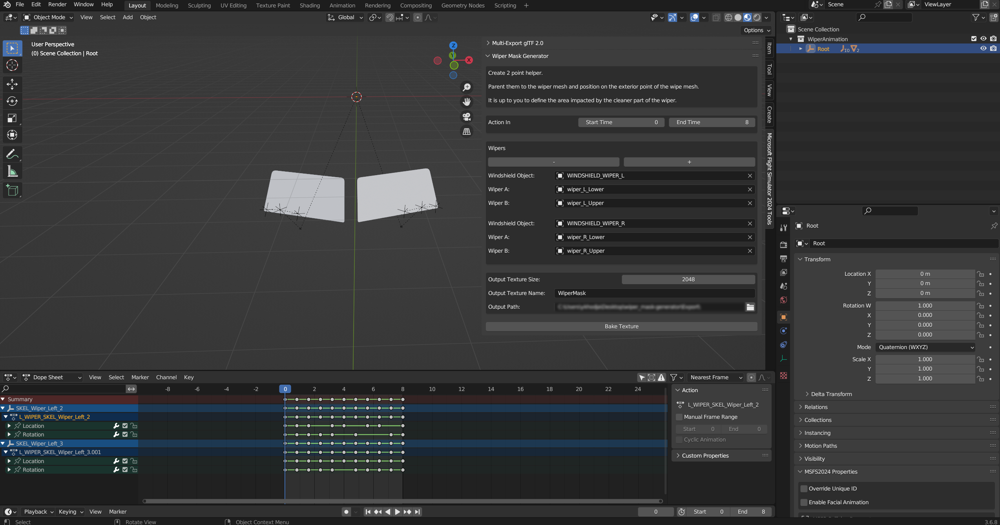
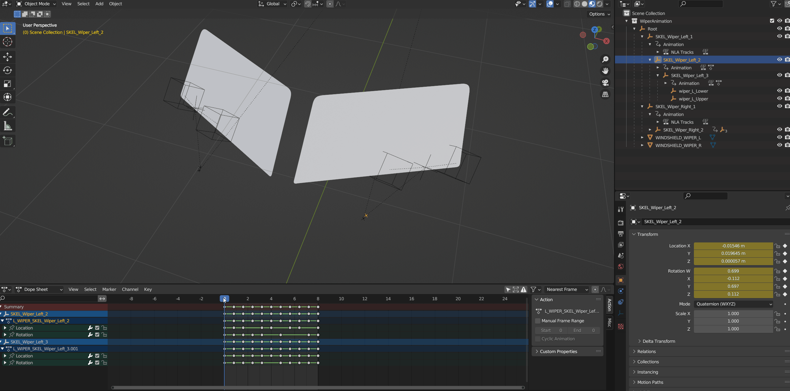
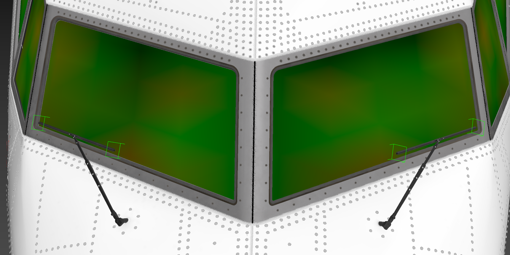
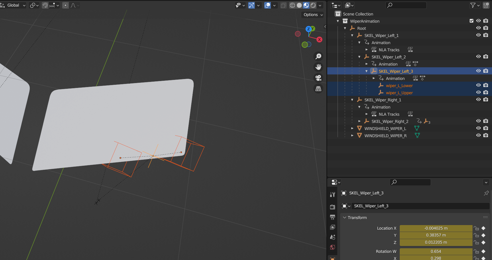
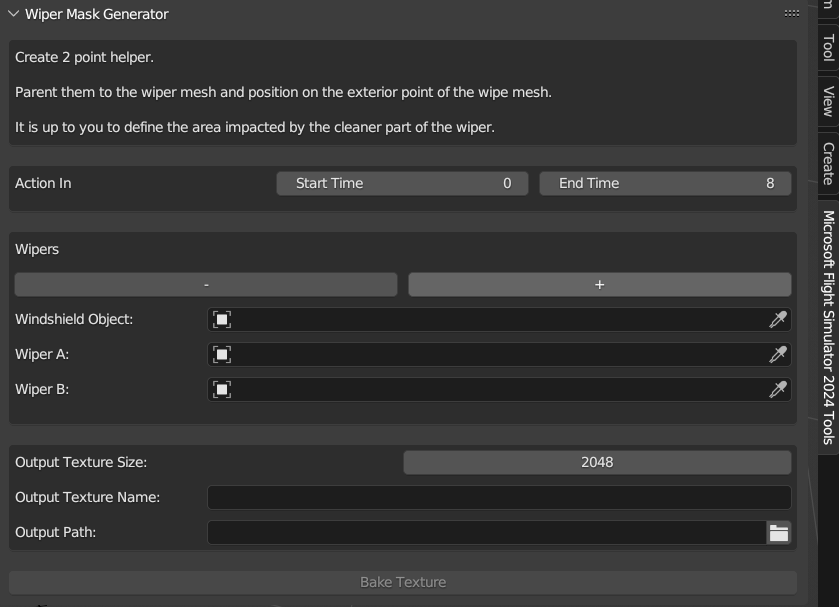
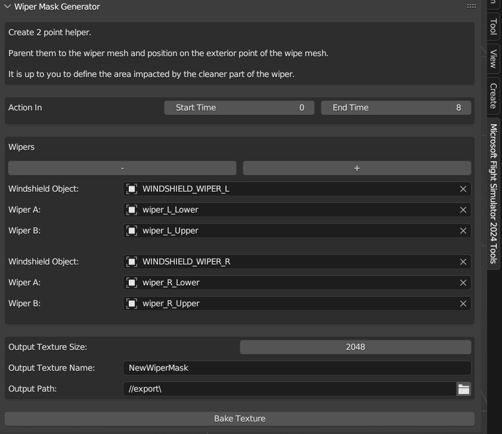
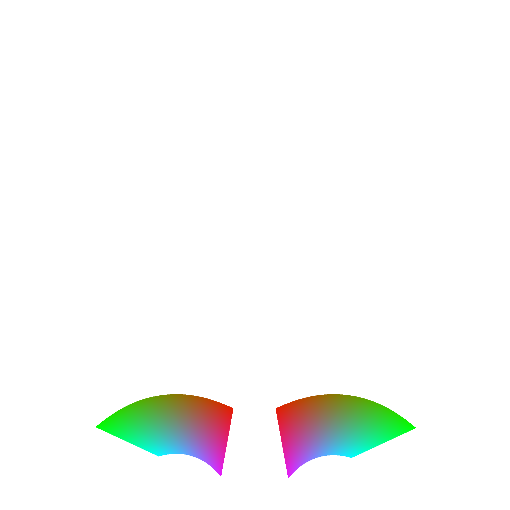
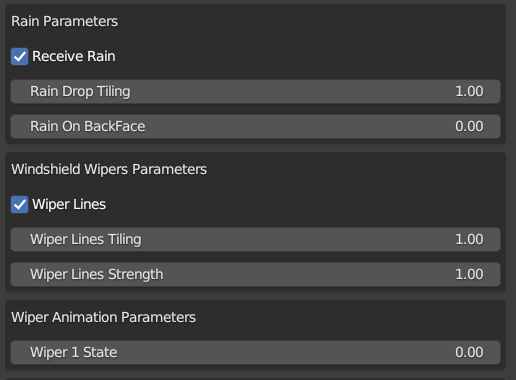

*******

# Summary
- [Introduction](#introduction)
- [Animate wipers](#animate-wipers)
- [Generate Wiper Mask Texture](#generate-wiper-mask-texture)

*******
# Introduction
This tool shows a brief overview of how to set up the wiper models. In "`example/blender`" folder you will find [WiperMask.blend](./example/blender/WiperMask.blend) (a sample blend scene) that shows an example on how to set up your wipers (animation) and what parameters you need to give the tool to get the baked texture output. 

# Animate wipers
1. Depending on how you have setup your wiper's rig. Animate your bone following your aircraft windshield. In our case the wipers are already animated in the blend scene:

2. Now that you have your wipers animated, you need to place a dummy on both tips of each wiper, each dummy must be child of the last wiper animated bone. 

# Generate Wiper Mask Texture:
<ol type="1">
<li> Now you have to set some mandatory parameters in the `Wiper Mask Generator` tool to get your output baked.</li>

<li> You will need to add at least one wiper in `Wipers` to get your baked texture.</li>

<ul>
    <li><strong>Action In:</strong></li>
        <ul>
            <li><strong>Start time:</strong> time in animation for idle position.</li>
            <li><strong>End Time:</strong> time in animation for fully "open" position</li>
        </ul>
    <li><strong>Windshield Object:</strong></li> Here you need to give the object of the windshield mesh.
    <li><strong>Wiper A:</strong></li> Here you need to give the first wiper affecting the windshield mesh.
    <li><strong>Wiper B:</strong></li> Here you need to give the second wiper affecting the windshield mesh.
    <li> You can add as many wipers as you want in new configurations. In out case we will have two of them, the wipers on the left side and the wipers on the right side.</li>
    <li><strong>Output Texture Name:</strong></li> Name of the output by default it would be "<i>NewWiperMask</i>".
    <li><strong>Output Texture Path:</strong></li> The output path where you can find your baked wiper mask texture.
</ul>

<li> When you have set all these parameters, you can click on "<i>Bake Texture</i>" button and you'll find your baked mask in the output folder you have given.

<li> In our case you can find the baked texture in "<code>example/export</code>" folder. Here is a preview:

<li> This texture must be plugged into the Wiper Mask slot of the Windshield material </li>

<li> To sync the effect with the wipers animations, you need to animate the wiper state value on the material. </li>

<li>This is what you should finally have in the sim: </li>

