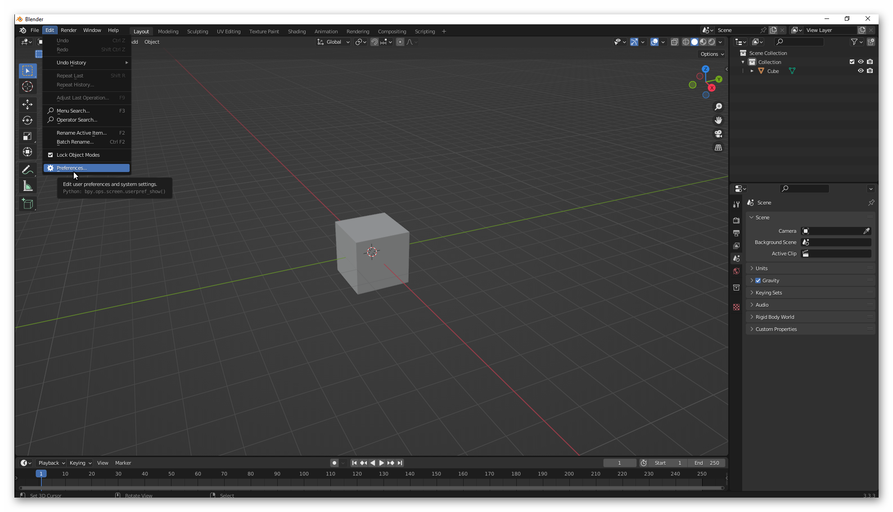
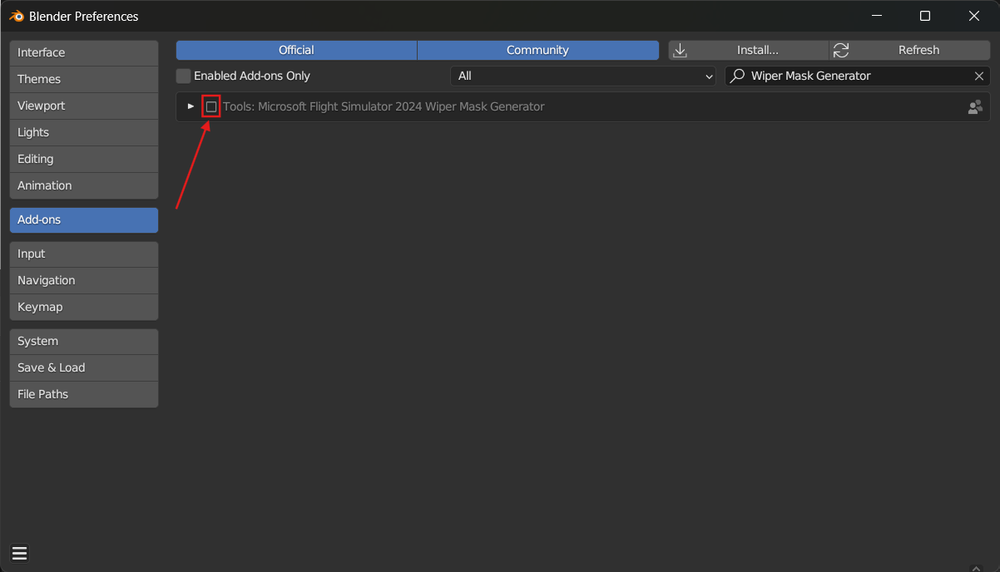
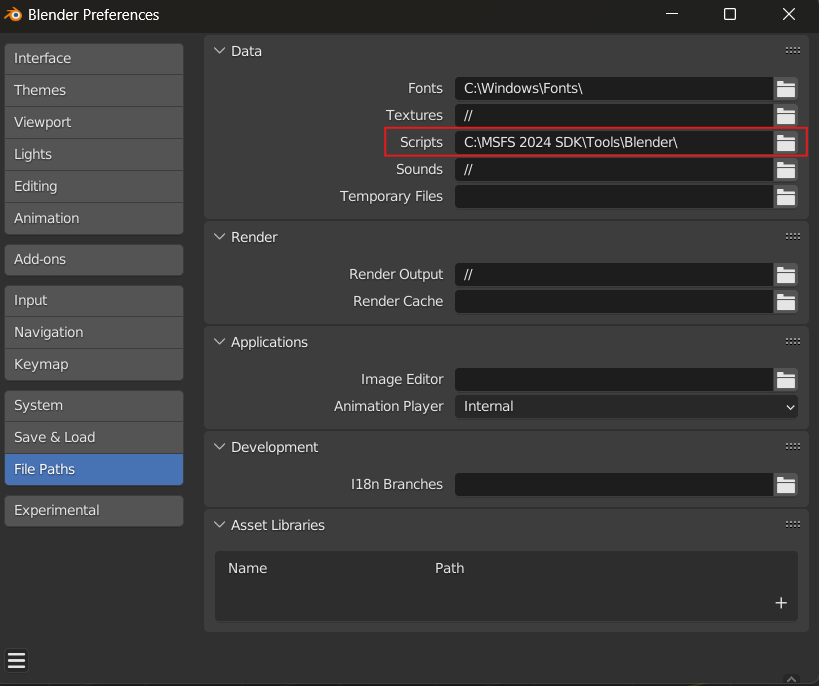
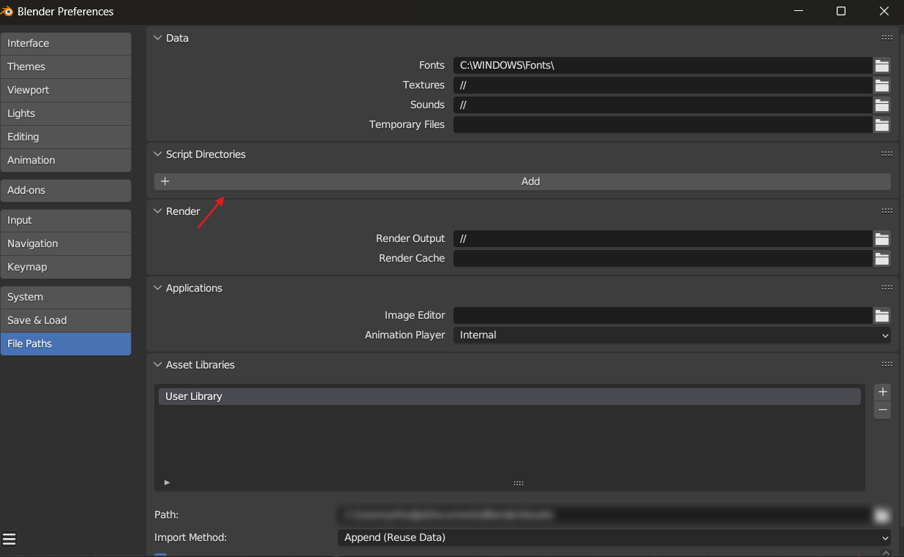
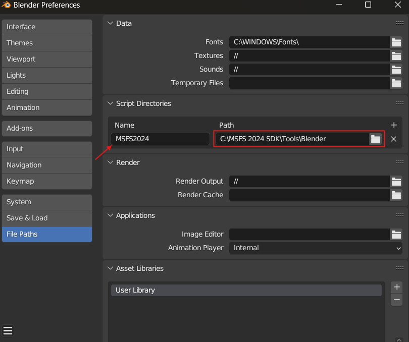

# Wiper Mask Generator for Microsoft Flight Simulator 2024 and Blender
The Wiper Mask Generator is a stand alone tool that is designed to help artists create the complex Wiper Mask (RGBA) texture that is used to create realistic rain and wiper effects on aircraft windshields. This section simply gives an overview of the tool, but you can find a tutorial on how to use it here

*******

# Summary
- [How to Install the Add-on](#how-to-install-the-add-on)
  - [How to Install the Wiper Mask Generator for Microsoft Flight Simulator 2024 using Blender and the addon zip](#how-to-install-the-wiper-mask-generator-for-microsoft-flight-simulator-2024-using-blender-and-the-addon-zip)
  - [How to Install the Wiper Mask Generator for Microsoft Flight Simulator 2024 using addons path](#how-to-install-the-wiper-mask-generator-for-microsoft-flight-simulator-2024-using-addons-path)
  - [How to Install the Wiper Mask Generator for Microsoft Flight Simulator 2024 by Copy Paste to AppData](#how-to-install-the-wiper-mask-generator-for-microsoft-flight-simulator-2024-by-copy-paste-to-appdata)
- [How to remove the Add-on](#how-to-remove-the-add-on)
- [Documentation](#documentation)

*******

# How to Install the Add-on

There are three ways to install the Wiper Mask Generator for Microsoft Flight Simulator 2024. Either using the Edit Preferences Menu and Install tab, give Blender the path to addons folder or copy/paste the addon files to your %APPDATA% folder. Installation steps are explained down bellow :

## How to Install the Wiper Mask Generator for Microsoft Flight Simulator 2024 using Blender and the addon zip

1. Go to `"<InstallDir>\MSFS 2024 SDK\Tools\Blender"` folder and zip the folder `wipermask_generator_msfs_2024`

2. Open Blender and go to : Edit > Preferences.

3. Go to Add-ons and click on Install an add-on. This will bring up a file dialog, where you navigate to the folder where you have your `wipermask_generator_msfs_2024.zip` file.

4. Select the `wipermask_generator_msfs_2024.zip` file.  And click on the Install Add-on button.

5. Enable the Add-on by clicking on the checkbox.

 

## How to Install the Wiper Mask Generator for Microsoft Flight Simulator 2024 using addons path

1. Open Blender and go to : Edit > Preferences.

2. Give blender the path `"<InstallDir>\MSFS 2024 SDK\Tools\Blender"` containing the addons folder:

    * In Blender 3.3.xLTS:

        A. Click on : File Paths and in the section `Script` select the `Blender` folder in your `"<InstallDir>\MSFS 2024 SDK\Tools\Blender"` path.

        
        
        :warning: You can have only one path for your user addons using Blender 3.3.xLTS, if you already have an addon path set up here you can also copy the folder `wipermask_generator_msfs_2024` in your addons folder.

    - In Blender 3.6.xLTS:

        A. Click on : File Paths and in the section `Script Directories` click on `Add` button.

        

        B. Select the `Blender` folder in your `"<InstallDir>\MSFS 2024 SDK\Tools\Blender"` path and give it the name you want in the section name.

        

        :warning: You can add as many paths as you wish for your user addons using Blender 3.6.xLTS.

3. Restart Blender.

4. Go to : Edit > Preferences > Add-ons and search for `Microsoft Flight Simulator 2024 Wiper Mask Generator` and enable the addon

## How to Install the Wiper Mask Generator for Microsoft Flight Simulator 2024 by Copy Paste to AppData

1. Close Blender if you have it open.

2. Go to `"<InstallDir>\MSFS 2024 SDK\Tools\Blender"` folder and copy to the clipboard (Ctrl + C) the folder `wipermask_generator_msfs_2024`

3. Now browse to the Blender `addons` folder, which - by default - can be found in the following locations:

   - **Windows**: This will usually be in `%AppData%\Blender Foundation\Blender\<blender-version>\scripts\addons\`.

   - **Mac OS X**: This will be in your Library (Press the *Option* key when in Finder's `Go` menu to open your Library folder): `\Users\<username>\Library\Application Support\Blender\<blender-version>\scripts\addons\`.

4. Paste the `wipermask_generator_msfs_2024` into the Blender `addons` folder (Ctrl + V).

After completing the process outlined above, you will need to start Blender and then activate the plugin. Activation is done from Edit > Preferences, as shown in the image below:

**NOTE** : You may need to restart Blender again after activating the plugin for all the options to be visible in the IDE.

# How to remove the Add-on

1. If you previously installed the Microsoft Flight Simulator 2024 glTF Extensions Add-on, Remove/Delete the older version using the Blender Edit > Preferences Menu. 

2. Select the Add-ons tab. Search for the `Microsoft Flight Simulator 2024 Wiper Mask Generator` add-on in the search box. Delete the `Tools: Microsoft Flight Simulator 2024 Wiper Mask Generator` using the `Remove` button.   

**NOTE**  If you have installed the addon using the addons folder in `Script Directories` see [here](#how-to-install-the-wiper-mask-generator-for-microsoft-flight-simulator-2024-using-addons-path). You just need to remove this pah from Blender preferences and restart Blender. 

# Documentation:

We provide a blender scene with a tutorial document explaining how to use the tool [here](./DOCUMENTATION.md). You can also find more information about `Wiper Masks` in the SDK documenttation.